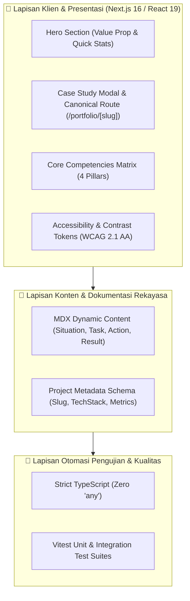

# 🏛️ Personal Portfolio & Technical Showcase — Mikail Nurwahid

<div align="center">


**Etalase Portofolio Web Mandiri untuk Pembuktian Arsitektur & Studi Kasus Rekayasa**  
*Dibangun oleh Junior Mobile Developer yang berfokus pada arsitektur bersih, persistensi offline-first, dan pengujian otomatis.*

[Arsitektur Sistem](#-1-arsitektur-sistem--clean-web-architecture) •
[Studi Kasus STAR](#-2-metode-star-problem-solving) •
[Modal Landing-Page Flow](#-3-dialog-studi-kasus-continuous-scroll) •
[Kontrak Antarmuka Publik](#-4-kontrak-antarmuka-publik-typescript) •
[Verifikasi Kualitas](#-5-laporan-verifikasi-kualitas--test-suite)

---

</div>

> 💡 **Tentang Repositori Ini:**  
> Repositori ini adalah **Public Architecture Showcase** untuk antarmuka dan studi kasus portofolio personal Mikail Nurwahid. Menyajikan keterbukaan struktur komponen, kontrak antarmuka TypeScript, dan metodologi pemecahan masalah teknis. Basis kode produksi penuh disimpan di repositori privat internal [`Michaelo7710/personal-portfolio-ai`](https://github.com/Michaelo7710/personal-portfolio-ai).

---

## 🎯 Mengapa Proyek Ini Dibangun? (The Core Problem)

Bagi seorang pengembang pemula (*junior software engineer*), menyampaikan kompetensi teknis kepada calon tim kerja merupakan tantangan besar:
1. **Resume Konvensional yang Pasif:** Daftar keahlian di atas kertas sering kali tidak mencerminkan bagaimana pengembang berpikir, menstrukturkan kode, atau menangani *edge cases*.
2. **Kebutuhan Bukti Nyata (Proof of Craftsmanship):** Engineering Lead dan rekan setim mencari rekan kerja yang disiplin: memahami Clean Architecture, memisahkan lapisan tanggung jawab, serta membiasakan diri menulis automated tests untuk menjaga stabilitas sistem.
3. **Kemudahan Verifikasi Pihak Ketiga:** Menyediakan akses langsung ke kode repositori publik dan biner fisik (APK Android) tanpa friksi formulir atau proses registrasi yang membingungkan.

---

## 🏛️ 1. Arsitektur Sistem — Clean Web Architecture

Aplikasi dibangun di atas **Next.js 16 App Router** dengan pemisahan lapisan tanggung jawab yang rapi:



---

## 🌟 2. Metode STAR (Problem Solving & Dampak Terukur)

Setiap proyek dalam portofolio dianalisis menggunakan kerangka kerja **STAR**:
- **Situation:** Masalah nyata di lapangan dan akar penyebabnya (bukan sekadar gejala permukaan).
- **Task:** Mandat rekayasa dan batasan arsitektur yang harus dipatuhi.
- **Action:** Langkah teknis nyata yang diimplementasikan (arsitektur, pola desain, basis data, dan proteksi kegagalan).
- **Result:** Dampak kuantitatif terukur dan bukti verifikasi test suite.

---

## 📱 3. Dialog Studi Kasus (Continuous Landing-Page Flow)

Antarmuka modal studi kasus dirancang untuk memberikan kenyamanan membaca maksimal bagi perekrut:
- **Aliran Terbuka Bebas Hambatan:** Menghilangkan batasan tinggi kontainer sempit; seluruh detail studi kasus mengalir bebas dari atas ke bawah layaknya membaca artikel landing page.
- **Tombol Tutup Melayang (*Floating Sticky Close*):** Tombol penutup yang ramah sentuhan (≥ 48px) tetap mengapung anggun di pojok kanan atas dengan efek *backdrop-blur* saat pengguna menggulir halaman.
- **Dukungan Inersia Layar Sentuh:** Pengguliran memanfaatkan *native momentum scrolling* dengan `overscroll-contain` untuk memastikan responsivitas halus pada seluruh perangkat Android dan iOS.

---

## 📋 4. Kontrak Antarmuka Publik (TypeScript)

Definisi tipe data antarmuka publik diekspos dalam direktori [`contracts/`](./contracts):
- [`contracts/portfolio-schema.ts`](./contracts/portfolio-schema.ts): Tipe data metadata proyek, metrik rekayasa, dan struktur STAR.

---

## 🧪 5. Laporan Verifikasi Kualitas & Test Suite

Seluruh komponen dan fungsi divalidasi secara otomatis:

```text
✓ TypeScript Typecheck  : 0 Errors (Strict Type-Safety)
✓ ESLint Analysis       : 0 Warnings, 0 Errors
✓ Vitest Test Suite     : 100% Passing Green
✓ Next.js Build SSG     : 23 Static Routes Generated
```

---

<div align="center">

**Mikail Nurwahid — Junior Mobile Developer**  
*Membangun aplikasi mobile dan sistem web dengan kejujuran, disiplin Clean Architecture, dan komitmen belajar berkelanjutan.*

[](https://github.com/Michaelo7710)
[](https://wa.me/6281234567890)

</div>
